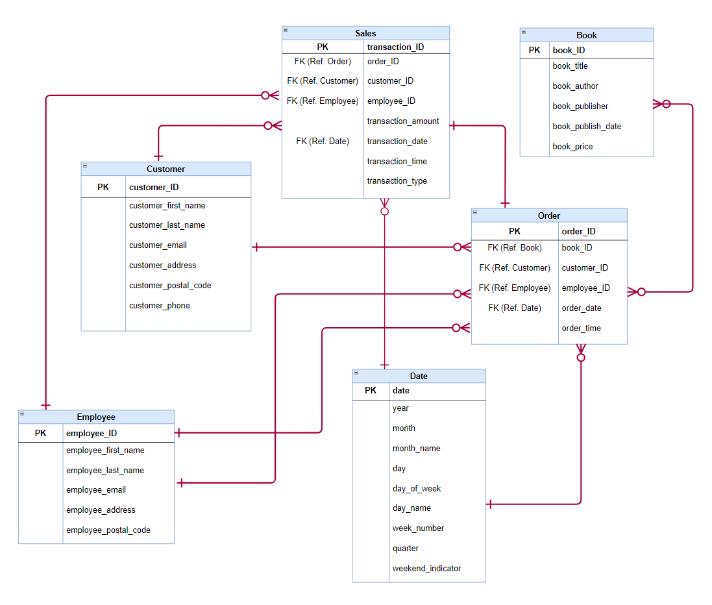
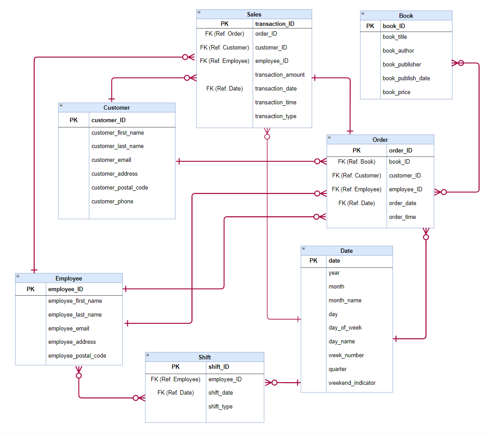
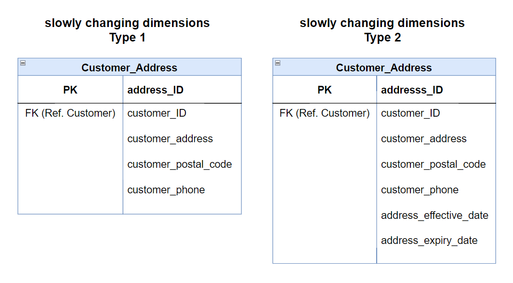

# Assignment 1: Design a Logical Model

## Question 1
Create a logical model for a small bookstore. 📚

At the minimum it should have employee, order, sales, customer, and book entities (tables). Determine sensible column and table design based on what you know about these concepts. Keep it simple, but work out sensible relationships to keep tables reasonably sized. Include a date table. There are several tools online you can use, I'd recommend [_Draw.io_](https://www.drawio.com/) or [_LucidChart_](https://www.lucidchart.com/pages/).



## Question 2
We want to create employee shifts, splitting up the day into morning and evening. Add this to the ERD.



## Question 3
The store wants to keep customer addresses. Propose two architectures for the CUSTOMER_ADDRESS table, one that will retain changes, and another that will overwrite. Which is type 1, which is type 2?

_Hint, search type 1 vs type 2 slowly changing dimensions._



Bonus: Are there privacy implications to this, why or why not?
```
For type 1 SCD, there are fewer privacy concerns, since old data is overwritten and not retained. This could be beneficial in minimizing the amount of personal data stored.

Type 2 SCD stores more personal information over time, and it retains a complete history of customer addresses. Therefore, there could be privacy concerns. It is important to make sure that appropriate data protection measures are in place, such as encryption to protect customer privacy.
```

## Question 4
Review the AdventureWorks Schema [here](https://i.stack.imgur.com/LMu4W.gif)

Highlight at least two differences between it and your ERD. Would you change anything in yours?
```
AdventureWorks extensively uses normalized and lookup tables in comparison to my ERD. For example, it has seperate tables for addresses, phone numbers, email addresses in Person Schema, which are referenced by other tables like Person, Password, and Bussiness Entity Address. It also has different schemas which helps to easily identify relationships between entities. In my ERD there is only one schema and attributes like customer_address, customer_email, and customer_phone are part of Customer table. Similarly, employee_address, employee_email, and employee_phone are part of the Employee table.

I would consider normalizing my ERD by breaking down the tables, and creating seperate tables and lookup tables, for example for transaction_types and shift_types to improve data integriy, and facilitate easier updates and scalability.
```

# Criteria

[Assignment Rubric](./assignment_rubric.md)

# Submission Information

🚨 **Please review our [Assignment Submission Guide](https://github.com/UofT-DSI/onboarding/blob/main/onboarding_documents/submissions.md)** 🚨 for detailed instructions on how to format, branch, and submit your work. Following these guidelines is crucial for your submissions to be evaluated correctly.

### Submission Parameters:
* Submission Due Date: `June 1, 2024`
* The branch name for your repo should be: `model-design`
* What to submit for this assignment:
    * This markdown (design_a_logical_model.md) should be populated.
    * Two Entity-Relationship Diagrams (preferably in a pdf, jpeg, png format).
* What the pull request link should look like for this assignment: `https://github.com/<your_github_username>/sql/pull/<pr_id>`
    * Open a private window in your browser. Copy and paste the link to your pull request into the address bar. Make sure you can see your pull request properly. This helps the technical facilitator and learning support staff review your submission easily.

Checklist:
- [x ] Create a branch called `model-design`.
- [x ] Ensure that the repository is public.
- [x ] Review [the PR description guidelines](https://github.com/UofT-DSI/onboarding/blob/main/onboarding_documents/submissions.md#guidelines-for-pull-request-descriptions) and adhere to them.
- [x ] Verify that the link is accessible in a private browser window.

If you encounter any difficulties or have questions, please don't hesitate to reach out to our team via our Slack at `#cohort-3-help`. Our Technical Facilitators and Learning Support staff are here to help you navigate any challenges.
